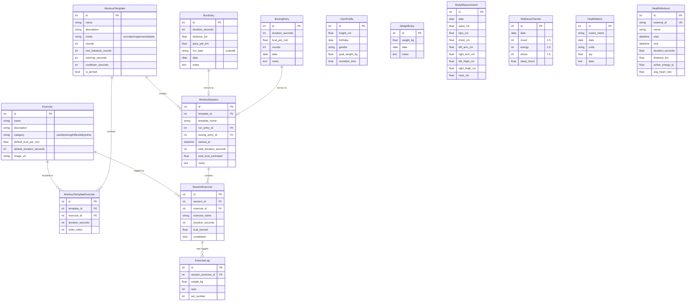
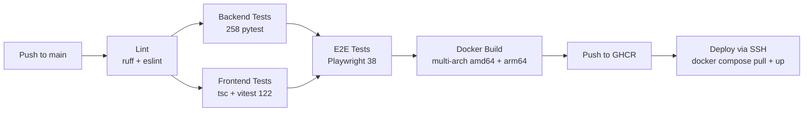

# FitnessTracker

A complete fitness PWA — track workouts, runs, walks, boxing, health metrics, and wellness. Works on any device. Installable, offline-capable, dark/light theme.

**Live:** [fit.nergy.space](https://fit.nergy.space)

**Stack:** React 19 + TypeScript + Vite + Tailwind CSS 4 (frontend) · FastAPI + SQLAlchemy + SQLite + Alembic (backend) · Docker Compose + Nginx · GitHub Actions CI/CD

## Features

### Workouts
- **195 seeded exercises** with images — 37 cardio, 116 strength, 42 flexibility
- **5 circuit templates** (Basic, Calisthenics, Beginner Calisthenics, Cardio, Dumbbells) with per-exercise durations, configurable rounds, rest between rounds
- **Tabata mode** — fixed 20s work / 10s rest intervals per round
- **Warmup & cooldown phases** with separate timers
- **Full-screen runner** — progress ring, exercise image, audio cues + text-to-speech
- Skip, pause, and real-time duration editing during workouts

### Run & Walk Tracking
- Log runs and walks with distance, duration, pace, and randomized note prompts
- Run stats: total distance, best pace, average pace
- Walk stats: total distance, total hours

### Boxing Tracking
- Log boxing sessions with duration, rounds, kcal/min, and notes
- Boxing stats: total sessions, hours, kcal, PRs, monthly breakdown, trend charts

### History & Stats
- Session history with date range filtering (7 Days, 30 Days, This week, Calendar)
- Activity-colored left border on session cards (orange/blue/green/red)
- Weekday bar chart + GitHub-style contribution heatmap (30-day)
- JSON import/export of sessions
- Stats overview: total sessions, hours, kcal, streak tracking

### Health & Wellness
- **Weight tracking** with charts, goal progress bar, BMI calculator
- **Personal records** across weight, measurements, performance, runs, walks, boxing
- **Body measurements** (waist, hips, chest, arms, thighs, neck) with before/after deltas
- **Daily wellness check-ins** — mood, energy, stress, sleep hours — 8-week trends
- **Health score** (0-100) from BMI, workout consistency, streak, measurements
- **Apple Health import** — workouts + metrics from exported ZIP, Workout Intensity scatter chart

### PWA & UX
- Installable on iOS/Android/desktop with service worker precache
- Swipe left/right to navigate between tabs with native-feel slide animation
- Pill-shaped active indicator on bottom nav
- Loading skeleton states on all tabs
- Offline banner + ErrorBoundary for resilience
- Light/dark theme toggle, audio mute, selectable date format (D/M or M/D)
- Push notification support (Web Push API)
- Settings: health profile, backup/restore, notifications, Apple Health import

## Entity Relationship Diagram



## CI/CD Pipeline



## Quick start

```bash
make        # venv + node deps, seed DB, start backend + frontend, open browser
```

Ports are configurable:
```bash
make FRONTEND_PORT=5210 BACKEND_PORT=8010
```

## Docker

```bash
docker compose up
```

Then open **http://localhost:8080**. The frontend proxies `/api` to the backend over an internal Docker network — no CORS, no API URL to configure.

`docker-compose.yml` pins `:latest` images from GHCR with `build:` sections for local builds:

```bash
docker compose build
docker compose push        # requires: docker login ghcr.io
```

## CI/CD

`.github/workflows/docker-publish.yml` runs on every push to `main`:

```
lint (ruff + eslint) → backend tests (258) → frontend type-check + vitest (122) → E2E (Playwright, 38) → Docker build/push (multi-arch) → deploy via SSH
```

## Development

```bash
make setup          # one-time: venv + node deps
make run-backend    # FastAPI with hot reload (http://localhost:8000, docs at /docs)
make run-frontend   # Vite dev server (http://localhost:5173)
```

The backend auto-creates tables and applies Alembic migrations on startup. Seeding is idempotent.

## Testing

```bash
make e2e     # Playwright: boots isolated backend + frontend, runs the suite
```

Backend unit tests:
```bash
cd backend && .venv/bin/python -m pytest tests/ -v   # 258 tests
```

Frontend unit tests:
```bash
cd frontend && npx vitest run                         # 122 tests
```

## Project structure

```
backend/               FastAPI app
  app/
    main.py            app + CORS + startup migrations
    models/            SQLAlchemy models (14 tables)
    routers/           exercises, workouts, sessions, stats, runs, boxing, health, backup, auth, notifications, health_import
    schemas.py         Pydantic schemas
  alembic/             7 migrations with forward/backward validation
  seed.py              195 exercises + 5 starter workouts
  scripts/             image importer, fake-history seeder, migration validator
  Dockerfile
frontend/              React + Vite PWA
  src/
    api.ts             typed API client
    components/        tabs, runner, editor, health, stats, history, settings, controls
    sound.ts           audio cues + TTS
  e2e/                 Playwright tests (38)
  Dockerfile, nginx.conf
docker-compose.yml
Makefile
```
